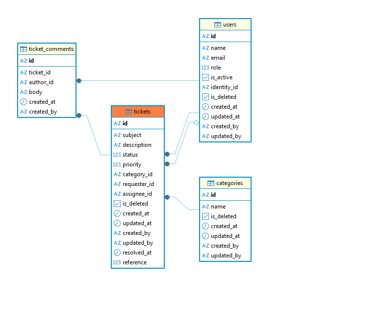
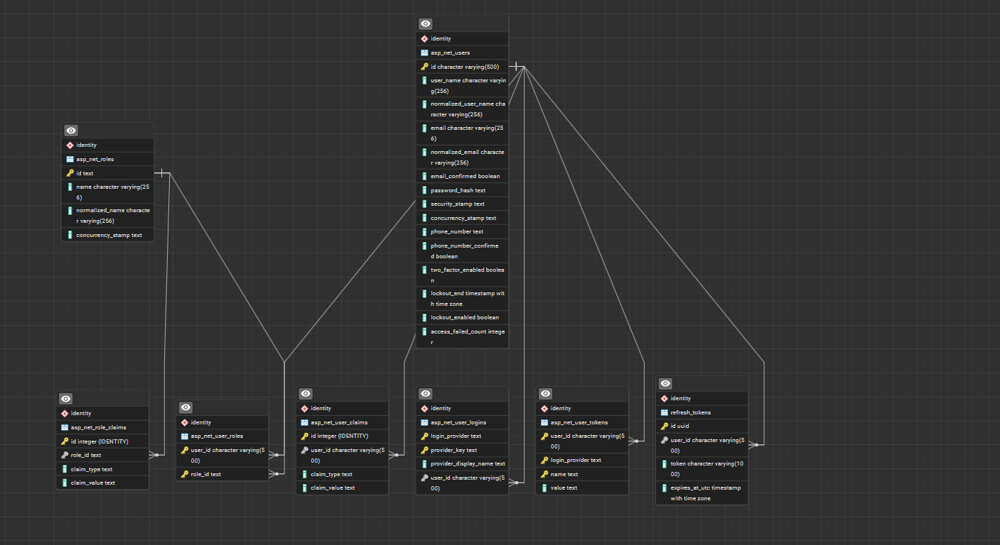

# Helpdesk API

REST API for the support helpdesk. ASP.NET Core (.NET 10), EF Core 9, PostgreSQL, ASP.NET
Identity for credentials, JWT bearer auth, FluentValidation, RFC 7807 ProblemDetails.

Pairs with the `helpdesk-web` React frontend. The two are separate repositories; this one
serves the API only and ships no UI.

---

## Contents

- [Running it](#running-it) — start here
- [Troubleshooting](#troubleshooting) — what to do when a step fails
- [Seeded data and logins](#seeded-data-and-logins)
- [How it is organised](#how-it-is-organised)
- [The database](#the-database) — the two schemas, and why Identity is there
- [API reference](#api-reference)
- [Conventions](#conventions)
- [Architecture, and why](#architecture-and-why)
- [Working on it](#working-on-it) — migrations, resetting, adding an endpoint
- [Known limitations](#known-limitations)

---

## Running it

### Quick start — Docker

From a fresh clone, one command:

```bash
cd backend                 # the folder holding docker-compose.yml
docker compose up -d --build
```

That is the whole procedure. There is **no config file to copy, no database to install, and
no .NET SDK required** — Compose builds the API, starts Postgres, waits for it to pass a
healthcheck, applies both sets of migrations and seeds the data. First run takes a couple of
minutes for the build; after that it is seconds.

| | |
|---|---|
| **API** | **http://localhost:5000** |
| OpenAPI document | http://localhost:5000/openapi/v1.json (anonymous) |
| Postgres | `localhost:5439`, user `postgres`, password `postgres` |
| Log in as | `admin@example.com` / `Password123!` — [three more accounts](#seeded-data-and-logins) |

Confirm it came up:

```bash
curl -s http://localhost:5000/api/auth/login   -H "Content-Type: application/json"   -d '{"email":"admin@example.com","password":"Password123!"}'
```

An `{"accessToken":"eyJ…"}` back means the whole chain worked — container, database,
migrations, seed.

Useful from there:

```bash
docker compose logs -f backend     # follow the API
docker compose ps                  # both should be Up, Postgres "(healthy)"
docker compose down                # stop
docker compose up -d --build       # after pulling new code
```

Both services are `restart: unless-stopped`, so they come back by themselves after a reboot
or a Docker Desktop update. `docker compose down` is what keeps them down.

> **The frontend is not in Compose.** Only the API and its database are containerised. Run
> `helpdesk-web` on your machine with `npm install && npm run dev` and open
> **http://localhost:5173** — its Vite dev server proxies `/api` to the container on 5000, so
> nothing to configure. See [step 5](#5-the-frontend).

### The other two ways to run it

Both are for working *on* the API rather than just running it, and both need you to start
Postgres yourself:

| You want | Do this | Where Postgres comes from |
|---|---|---|
| **A local debug loop** — breakpoints, fast rebuilds, no image to rebuild | Steps 1-5 below | You start it: `docker compose up -d helpdesk.postgres` (step 2) |
| **F5 in Visual Studio** | [Pick the right profile](#if-you-open-this-in-visual-studio) — the two container profiles are **not** equivalent | Depends on the profile. One of them starts no database at all, and does not publish port 5000. |

Whichever you pick, *something* has to be serving Postgres before the API starts. Nearly
every startup failure in [Troubleshooting](#troubleshooting) is that and nothing more.

### What you need

For the [Docker quick start](#quick-start--docker), **only Docker Desktop** — nothing else,
not even the .NET SDK. The image builds the API inside itself.

Steps 1-5 below run the API on your machine instead, and need:

| | |
|---|---|
| **.NET 10 SDK** | `dotnet --version` should print `10.*`. [Download](https://dotnet.microsoft.com/download) |
| **PostgreSQL 17** | Docker Desktop is the quickest route; a local install works identically |
| **A terminal in `backend/`** | Every command below is run from the folder holding `docker-compose.yml` |

You do **not** need `dotnet-ef` installed to run the app — migrations apply themselves on
startup in Development. You only need it to *create* a new migration; see
[Working on it](#working-on-it).

### 1. Configuration

`appsettings.Development.json` is **deliberately not in the repository** — it holds the
database password and the JWT signing key. A committed template sits beside it:

```bash
cd backend            # the inner project folder, i.e. backend/backend
cp appsettings.Development.example.json appsettings.Development.json
```

On Windows PowerShell:

```powershell
Copy-Item appsettings.Development.example.json appsettings.Development.json
```

The template already carries working local values — for a normal local setup you can copy
it and move on to step 2 without editing anything. The table says what each one is, and
which ones must change before this ever runs anywhere real:

| Setting | What it is | Safe local value |
|---|---|---|
| `ConnectionStrings:Database` | Postgres connection string. **Must match whatever you start in step 2.** | `Host=localhost;Port=5439;Database=TicketingSystem;Username=postgres;Password=postgres` |
| `Jwt:Key` | Symmetric signing key for access tokens. **At least 32 characters** or the app throws on startup. | any long random string |
| `Jwt:Issuer` / `Jwt:Audience` | Validated on every request. Leave them alone unless you change both sides. | `helpdesk-api` / `helpdesk-client` |
| `Jwt:ExpirationInMinutes` | Access-token lifetime. The template ships `30`. | `30` |
| `Jwt:RefreshTokenExpirationDays` | Lifetime of the stored refresh token. See [Known limitations](#known-limitations) — there is no endpoint to spend it on yet. | `7` |
| `Encryption:Key` | Reserved. **Exactly 32 bytes.** | any 32-character string |
| `Cors:AllowedOrigins` | Origins allowed to call the API from a browser. Already lists the Vite dev server. | `["http://localhost:5173", "http://localhost:5174"]` |

`Metrics` (`UnassignedOverdueHours`, `StaleInProgressDays`, `ThroughputDays`) has working
defaults in `appsettings.json` and only needs touching if you want to retune the admin
dashboard's thresholds — see [Architecture](#thresholds-are-configuration-not-constants).

> **This file is gitignored on purpose.** If you ever find yourself running `git add -f` on
> it, stop: it carries your database password and your token signing key.

### 2. Database

**With Docker**, from the `backend` folder (the one with `docker-compose.yml`):

```bash
docker compose up -d helpdesk.postgres
```

It publishes Postgres on **5439**, not the default 5432, so it cannot collide with a Postgres
you already run. That is why the connection string above says `Port=5439`.

> **If you ran an earlier version of this repo**, the service used to be called
> `devhabit.postgres`. Compose keys containers by service name, so the rename creates a new
> one and leaves the old container behind. Your data is safe either way — it lives in the
> bind mount at `./.containers/postgres_data`, not inside the container. Clear the orphan
> with `docker compose down --remove-orphans`, then bring the new one up.

The compose file reads the password from the environment and falls back to `postgres`:

```yaml
POSTGRES_PASSWORD: ${POSTGRES_PASSWORD:-postgres}
```

so no credential is committed. To use your own, put it in a `.env` file beside
`docker-compose.yml` (untracked) **and** in your connection string:

```
POSTGRES_PASSWORD=something-else
```

The data directory is bind-mounted to `./.containers/postgres_data`, which is gitignored.
Deleting that folder is the hard reset.

**Two optional services** are also defined and are not needed to run the API:
`helpdesk.seq` (log viewer, http://localhost:8080) and `helpdesk.aspire-dashboard`
(telemetry, http://localhost:18888). Both sit behind the `tools` profile, so they start
only with `docker compose --profile tools up -d`. Nothing in the code exports to either
yet — see [Dependencies](#dependencies).

**Running Postgres yourself instead?** Create an empty database, point
`ConnectionStrings:Database` at it, and skip to step 3 — the schema is created for you.

### 3. Run

```bash
cd backend            # the inner project folder
dotnet run --launch-profile http
```

The API listens on **http://localhost:5000**.

There is an `https` profile too (`https://localhost:7164`), but **use `http` for local
work**. HTTPS redirection is switched off in Development on purpose: the http profile
publishes only `:5000`, so a 307 to https would send the frontend to a port nothing is
listening on and the CORS preflight would die there.

**Migrations and seeding run automatically on startup, in Development only** — there is no
separate command. `Program.cs` runs four steps inside its `IsDevelopment()` block, in order:

1. `ApplyMigrationsAsync()` — creates the `ticket` schema
2. `ApplyIdentityMigrationsAsync()` — creates the `identity` schema
3. `SeedUsersAsync()` — four accounts, credentials *and* domain records
4. `SeedInitialDataAsync()` — three categories and twelve tickets

Both seeders are **idempotent**: each returns early if its data already exists, so
restarting never duplicates anything. Order matters — tickets reference users, so users
must be seeded first.

In any environment other than Development, **none of this runs** and you must apply the
schema yourself; see [Working on it](#working-on-it).

### 4. Check it actually works

```bash
curl -s http://localhost:5000/api/auth/login \
  -H "Content-Type: application/json" \
  -d '{"email":"admin@example.com","password":"Password123!"}'
```

A working install returns `{"accessToken":"eyJ…","refreshToken":"…"}`. Then:

```bash
TOKEN=<paste the accessToken>
curl -s "http://localhost:5000/api/tickets?limit=3" -H "Authorization: Bearer $TOKEN"
```

You should get three tickets inside a `{ "data": [...], "pagination": {...} }` envelope.

The OpenAPI document is at **http://localhost:5000/openapi/v1.json** in Development
(anonymous — no token needed to read it).

### Running the API in Docker too

The command itself is in the [quick start](#quick-start--docker); this is what it does and
why it needs nothing from you.

You do not need `appsettings.Development.json` for this path. It is gitignored, so a fresh
clone does not have one — and the image is built before anyone could copy it in, so the
container could never pick it up anyway. Everything the API needs to boot is therefore set
in `docker-compose.yml` itself: the connection string, `Jwt__Key`, and the CORS origins.
That is what makes `git clone && docker compose up` work with no setup step. The values
there are throwaway local ones and are **not** safe anywhere real.

Only `backend` and `helpdesk.postgres` start. The two optional tools are behind a profile:

```bash
docker compose --profile tools up -d      # adds seq + aspire-dashboard
```

They are gated because `helpdesk.seq` publishes on host **8080**, and if anything else on
your machine holds that port, an ungated `up` fails as a whole rather than just skipping
the log viewer neither the API nor the tests need.

#### If you open this in Visual Studio

Two launch profiles start a container, and they are not the same thing:

| Profile | What it does |
|---|---|
| **Docker Compose** (the `docker-compose.dcproj` startup project) | Runs the compose stack above. Postgres comes with it. This is the one to use. |
| **Container (Dockerfile)** (in `backend/Properties/launchSettings.json`) | Runs *only* the API container, with no compose and therefore no database. |

The second one still has to reach Postgres somehow, so the profile sets
`ConnectionStrings__Database` to `Host=host.docker.internal;Port=5439` — the container
crossing back out to the port your host publishes. **Start Postgres first**
(`docker compose up -d helpdesk.postgres`) or this profile has nothing to connect to.
`host.docker.internal` is a Docker Desktop convenience; on plain Linux Docker it does not
resolve unless you add it via `extra_hosts`.

> **Postgres has to already be up, and this profile will not start it.** It usually is —
> `helpdesk.postgres` is `restart: unless-stopped`, so it survives reboots and Docker Desktop
> updates. But if you have run `docker compose down`, F5 brings back the API alone, pointed
> at a host port nothing is serving. The error reads as a *network* failure rather than a
> missing database (see [Troubleshooting](#troubleshooting)), which sends people looking in
> the wrong place. `docker compose ps` first.

> **It also does not publish port 5000.** `publishAllPorts: true` hands the container random
> host ports — `0.0.0.0:32770->8080/tcp` — while the frontend's Vite proxy targets 5000.
> So `helpdesk-web` cannot reach an API started this way even when that API is perfectly
> healthy; you get `[api proxy] cannot reach http://localhost:5000` in the Vite console. If
> you are working on the frontend at all, use Compose or `dotnet run`, not this profile.

#### `docker-compose.override.yml`, and why it is easy to break

Compose merges `docker-compose.override.yml` into **every** `docker compose up`, on every
machine — not just the ones running Visual Studio, which is what generates it. Two things
follow, and both have bitten this repo:

- **Keep it cross-platform.** It mounts Visual Studio's user secrets and HTTPS dev
  certificate from `${APPDATA}`, which exists only on Windows. Bare, that collapses to
  `/Microsoft/UserSecrets` on macOS and Linux and Compose tries to create it at the
  filesystem root, so `docker compose up` fails before it builds anything. The file now
  writes `${APPDATA:-./.containers/vs}`, which keeps Windows behaviour and gives everyone
  else an empty ignored directory.
- **`ports` append, they do not replace.** Adding `"8080"` here does not change the
  `5000:8080` in `docker-compose.yml`; it publishes the container port a *second* time on a
  random host port. That is why `docker ps` used to list four mappings for one service. The
  override no longer declares ports at all.

If Visual Studio ever regenerates this file, check both points before committing it.

#### Why the connection string differs in a container

`appsettings.Development.json` says `Host=localhost`, which is right when the API runs on
your machine and wrong inside a container, where `localhost` is the API container itself
and nothing listens on 5432 there. So `docker-compose.yml` overrides it:

```yaml
- ConnectionStrings__Database=Host=helpdesk.postgres;Port=5432;...
```

Two details worth knowing. Environment variables outrank `appsettings.*.json` in ASP.NET
configuration, so this wins without editing the file. And `__` is the separator for a nested
key, so `ConnectionStrings__Database` is `ConnectionStrings:Database`. The port is `5432`,
not `5439` — containers reach each other on the service's own port; `5439` is only the
mapping onto your host.

Note the API still runs as **Development** in the container, so it migrates and seeds on
startup just like a local run.

#### The `pg_isready -h 127.0.0.1` in the healthcheck

Do not drop the `-h`. On a **first** run — a fresh clone, or after deleting
`./.containers/postgres_data` — the Postgres entrypoint starts a temporary server with
`listen_addresses=''` to run `initdb`, so it answers on the unix socket but not over TCP.
Without `-h`, `pg_isready` checks that socket, reports healthy while init is still running,
and the API connects to a port nothing is listening on yet. The failure is
`Connection refused` from the *correct* host, and it reproduces only on a cold start, never
against a volume that already exists.

### 5. The frontend

Start `helpdesk-web` (`npm install && npm run dev`) and open http://localhost:5173.

Its Vite dev server proxies `/api` to `http://localhost:5000` **server-to-server**, so CORS
does not apply in normal local development and `Cors:AllowedOrigins` is only exercised if
you point the browser at the API directly.

---

## Troubleshooting

| Symptom | Cause and fix |
|---|---|
| `Npgsql.NpgsqlException: Connection refused` on startup | Postgres is not running, or is on a different port. `docker compose ps` — the container should be up with `0.0.0.0:5439->5432/tcp`. Check `Port=5439` in your connection string. |
| `Failed to connect to [fdc4:…::254]:5439` with inner `SocketException: Network is unreachable`, from the **Container (Dockerfile)** profile | Same cause as the row above — nothing is serving host port 5439 — but it reports differently, so it is easy to chase the wrong thing. The IPv6 address is a red herring: `host.docker.internal` resolves to **both** `192.168.65.254` and a `fdc4:…` ULA, Npgsql tries the IPv6 one first, and the container has no IPv6 route, so the socket fails as `Network is unreachable` before it can be refused. Do not go configuring IPv6. Start the database: `docker compose up -d helpdesk.postgres`. |
| It all worked yesterday; today every container is `Exited (255)` with the same timestamp | Docker Desktop restarted or updated and took the stack down with it. Both services are `restart: unless-stopped` so this should now heal itself — if it has not, they were stopped explicitly (`docker compose down`/`stop`), which is exactly what that policy honours. Bring them back: `docker compose up -d`. Note the **Container (Dockerfile)** profile starts only the API, so F5 alone will not fix it. |
| `Failed to connect to 127.0.0.1:5432` when the **API runs in a container** | The container is using the `Host=localhost` string from `appsettings.Development.json`, where `localhost` means the API container itself. Start it with `docker compose up`, which sets `ConnectionStrings__Database` to `Host=helpdesk.postgres`. A bare `docker run` of the image skips compose entirely and hits exactly this. |
| `Connection refused` from the **right** host (`helpdesk.postgres`), only on a first run | The Postgres healthcheck went green during `initdb`, before the server accepted TCP. Check `docker-compose.yml` still has `-h 127.0.0.1` in the `pg_isready` test — see [the note above](#the-pg_isready--h-127001-in-the-healthcheck). |
| `password authentication failed for user "postgres"` | Your connection string password and the container's `POSTGRES_PASSWORD` disagree. `POSTGRES_PASSWORD` is only read when the data directory is first created, so setting a `.env` afterwards changes nothing — the volume kept the old password. Either delete `./.containers/postgres_data` and start again, or reset the password in place: `docker compose exec helpdesk.postgres psql -U postgres -c "ALTER USER postgres WITH PASSWORD 'postgres';"` (the local socket is `trust`, so this works without knowing the old one). |
| Connecting from your host works but from another container fails with the same password | Not a contradiction. The generated `pg_hba.conf` is `trust` for `127.0.0.1` and `scram-sha-256` for everything else, so loopback accepts *any* password while container-to-container traffic checks the real one. Test with the fix above, not with `psql` inside the Postgres container. |
| `IDX10720: Unable to create KeyedHashAlgorithm… key size must be greater than 256 bits` | `Jwt:Key` is shorter than 32 characters. |
| `appsettings.Development.json not found`, or a null connection string | You skipped step 1. Copy the example file. |
| App starts, but `/api/tickets` returns 401 with a valid-looking token | The access token expired (30 minutes by default). Log in again — there is no refresh endpoint yet. |
| Browser shows a CORS error instead of the validation message | Only happens when calling the API directly rather than through the Vite proxy. Add your origin to `Cors:AllowedOrigins`. |
| `relation "ticket.tickets" does not exist` | The app was started outside Development, so migrations never ran. See [Working on it](#working-on-it). |
| `dotnet ef` produces an **empty** migration | The running API holds a lock on `bin/`, so the tooling reads a stale assembly. Stop the API first, or build to a scratch path: `dotnet ef migrations add Name -- /p:OutputPath=obj/eftmp/`. |
| Seed data did not appear | The seeders skip if *any* category already exists. Drop the database (below) and restart. |
| Port 5000 already in use | Another API is running. Change `applicationUrl` in `Properties/launchSettings.json`, and `VITE_API_PROXY_TARGET` in the frontend's `.env`. |

**Full reset**, when the database is in a state you no longer trust:

```bash
docker compose down -v                 # stops containers and deletes the volume
rm -rf .containers/postgres_data
docker compose up -d helpdesk.postgres
cd backend && dotnet run --launch-profile http    # recreates the schema and reseeds
```

---

## Seeded data and logins

Four accounts, all with the password **`Password123!`**:

| Email | Name | Role | Frontend lands on |
|---|---|---|---|
| `admin@example.com` | Amina Admin | admin | `/admin` |
| `sam@example.com` | Sam Support | moderator | `/my-work` |
| `priya@example.com` | Priya Agent | moderator | `/my-work` |
| `jordan@example.com` | Jordan Employee | user | `/tickets` |

**Three categories** — `IT - Hardware`, `IT - Access & VPN`, `HR - Payroll` — with fixed ids
(`cat_it_hardware`, `cat_it_access`, `cat_hr_payroll`) so seeded tickets can reference them.

**Twelve tickets**, spread deliberately rather than randomly, so every filter has something
to find without you creating data:

- all four statuses — 5 Open, 3 InProgress, 2 Resolved, 2 Closed
- all four priorities, and all three categories
- **5 unassigned**; the rest split between Sam and Priya
- ages from one hour to seven days, so "oldest first" and the staleness metrics are visible
- the four terminal tickets carry a real `ResolvedAt`, so "average time to resolve" is a
  genuine figure rather than a dash

Every seeded ticket is requested by `usr_jordan`. Worth knowing: with a single requester you
cannot demonstrate "user A cannot see user B's ticket" without creating a second account.

---

## How it is organised

```
backend/                          ← repository root (docker-compose.yml lives here)
  backend/                        ← the ASP.NET Core project
    Program.cs                    composition root: DI, pipeline, dev-only migrate+seed
    Controllers/                  Auth, Tickets, Categories, Users, Metrics
    DTOs/
      <Area>/                     request/response records, validators, mappings, sort maps
      common/PaginationResult.cs  the one envelope every list returns
    Entities/                     Ticket, TicketComment, Category, User, RefreshToken, Roles
    Database/
      ApplicationDbContext.cs           domain, in the "ticket" schema
      ApplicationIdentityDbContext.cs   credentials, in the "identity" schema
      Configurations/                   one IEntityTypeConfiguration per aggregate
      Schemas.cs                        the two schema names as constants
    Extensions/
      DatabaseExtensions.cs       ApplyMigrations*, SeedUsers, SeedInitialData
      ClaimsPrincipalExtensions.cs
      ValidationExtensions.cs
    Middleware/                   GlobalExceptionHandler, ValidationExceptionHandler
    Services/
      TokenProvider.cs            issues the JWT
      UserContext.cs              resolves the caller's domain user, memory-cached
      Sorting/                    the sort whitelist: no client string reaches the DB
    Settings/                     JwtAuthOptions, CorsSettings, MetricsOptions
    Migrations/Application/       ticket schema history
    Migrations/Identity/          identity schema history
```

Each DTO area owns its request types, its FluentValidation validator, its entity mapping and
its sort whitelist, so adding a field is one folder rather than five.

---

## The database

One PostgreSQL database, **two schemas**: `ticket` holds the domain, `identity` holds
credentials. Two `DbContext` types map to them and each keeps its own migration history
table, so the two evolve independently.

### Why ASP.NET Identity is here at all

Storing a password is the part of an application that is least forgiving of a good guess.
Identity ships the pieces that are tedious to get right and dangerous to get wrong: PBKDF2
hashing with a per-user salt and a versioned format that can be re-hashed as the work factor
rises, normalised-email uniqueness, a security stamp that invalidates a session when the
password changes, and lockout counters. Hand-rolling that for a case study would have been
the wrong place to spend the risk budget.

What it is **not** used for here is the interesting part:

- **No `AspNetUserRoles`.** Roles live as a column on the domain user — see
  [Role is a column](#role-is-a-column-not-a-join). The Identity role tables exist because
  `IdentityDbContext` creates them; nothing writes to them.
- **No cookies, no `SignInManager` session.** `AuthController` uses `UserManager` only to
  check the password, then issues a JWT itself through `TokenProvider`. The API stays
  stateless.
- **No Identity profile data.** Name, `IsActive`, timestamps and role all moved out to the
  domain user; the migration that did it is called `StripDomainColumnsFromIdentityUser`.

So Identity is used as a **credential store**, not as an identity model. That is what makes
it replaceable: swap it for an external provider and the domain does not notice, because the
only thing pointing at it is one column.

### Why two schemas rather than one

They are different **kinds** of data with different lifecycles and different blast radii:

- **They version separately.** Each context has its own `__EFMigrationsHistory` inside its
  own schema (wired up in `Program.cs` via `MigrationsHistoryTable`). An Identity framework
  upgrade that rewrites its tables cannot collide with a domain migration, and neither can
  end up half-applied because of the other.
- **They are exposed differently.** Everything in `ticket` is read by ordinary endpoints.
  Nothing in `identity` is ever projected into a response — no query in the codebase joins
  across the boundary, because it *cannot*: they are separate contexts.
- **The boundary is a deletion boundary too.** A soft-deleted domain user disappears from
  every query through a global filter, while the credential row is untouched — so
  deactivating someone never risks orphaning a password hash or, worse, freeing an email for
  re-registration.
- **It keeps the swap cheap.** `User.IdentityId` is the only link. Replace the credential
  store and one column changes meaning; drop the `identity` schema entirely and the domain
  still stands up.

The cost is that a "user" is two rows, and both seeders have to create both. That is
`SeedUsersAsync`'s job, and it is why it must run before tickets are seeded.

### The `ticket` schema

The domain. Everything the API reads and writes.



> **Diagram goes here.** Save it as `docs/images/schema-ticket.png` and this renders on
> GitHub. Generate it from the live database with pgAdmin's ERD tool, DBeaver
> (*Database Navigator → schema → ER Diagram*), or JetBrains Rider — or draw it by hand.

| Table | Holds | Notes |
|---|---|---|
| `users` | the domain user: name, email, `role`, `is_active`, `identity_id` | soft-deleted; `identity_id` is the only link to the other schema |
| `categories` | ticket categories | soft-deleted, so removing one cannot orphan its tickets |
| `tickets` | the ticket itself | two FKs to `users` (`requester_id`, `assignee_id`) — EF cannot tell them apart, so `TicketConfiguration` names both explicitly — plus one to `categories`; `reference` is an identity column with a unique index |
| `ticket_comments` | the thread on a ticket | FK to `tickets` and to `users`; filtered by its parent ticket's `is_deleted` |
| `__EFMigrationsHistory` | this schema's migration history | separate from the identity one |

`assignee_id` is the only nullable relationship — null means unassigned.

### The `identity` schema

Credentials, and nothing else.



> **Diagram goes here.** Save it as `docs/images/schema-identity.png`.

| Table | Holds | Used? |
|---|---|---|
| `asp_net_users` | email, normalised email, password hash, security stamp, lockout | **yes** — the credential record |
| `refresh_tokens` | token, `expires_at_utc`, FK to `asp_net_users`, cascade delete, unique index on the token | **yes** — written at login, cleared at logout |
| `asp_net_roles`, `asp_net_user_roles` | Identity's own role model | **no** — role is a column on `ticket.users` |
| `asp_net_user_claims`, `asp_net_role_claims` | persisted claims | **no** — claims are minted into the JWT per request |
| `asp_net_user_logins`, `asp_net_user_tokens` | external logins, 2FA tokens | **no** — no external providers, no 2FA |
| `__EFMigrationsHistory` | this schema's migration history | |

Five of those eight tables exist only because `IdentityDbContext` creates them. They are
left in place rather than mapped away: removing them buys nothing and would make a future
move to external logins or 2FA a migration instead of a configuration change.

### How the two connect

```
        identity schema                      ticket schema
  ┌────────────────────────┐          ┌──────────────────────────┐
  │ asp_net_users          │          │ users                    │
  │  id                    │◄─────────│  identity_id             │
  │  email                 │          │  name, email             │
  │  password_hash         │          │  role  (User/Mod/Admin)  │
  │  security_stamp        │          │  is_active, is_deleted   │
  └────────────────────────┘          └──────────────────────────┘
             ▲                              ▲            ▲
             │                       requester_id   assignee_id
  ┌──────────┴─────────────┐          ┌──────┴────────────┴──────┐
  │ refresh_tokens         │          │ tickets                  │
  │  token (unique)        │          │  reference (identity)    │
  │  expires_at_utc        │          │  status, priority        │
  └────────────────────────┘          │  category_id ──► categories
                                      │  resolved_at             │
                                      └──────────────────────────┘
                                                 ▲
                                          ┌──────┴───────────────┐
                                          │ ticket_comments      │
                                          └──────────────────────┘
```

`users.identity_id` is drawn as an arrow, but it is **not** a database foreign key — it
cannot be, across two contexts. It is enforced in code, at the one place that creates both
rows together (`SeedUsersAsync`, and account creation in `UsersController`).

---

## API reference

Every route is enforced **on the route itself**, not only in the UI. Ownership rules an
attribute cannot express — a requester reading or commenting on their own ticket — are
checked inside the action and answer **403**.

| Method | Route | Who |
|---|---|---|
| `POST` | `/api/auth/login` | anonymous |
| `GET` | `/api/auth/me` | authenticated |
| `POST` | `/api/auth/logout` | authenticated |
| `GET` | `/api/tickets` | authenticated — a user sees only their own, staff see all |
| `POST` | `/api/tickets` | authenticated — `assigneeId` is staff-only and 403s otherwise |
| `GET` | `/api/tickets/{id}` | its requester, or any moderator/admin |
| `PATCH` | `/api/tickets/{id}` | moderator, admin |
| `DELETE` | `/api/tickets/{id}` | admin — soft delete |
| `POST` | `/api/tickets/{id}/comments` | its requester, or any moderator/admin |
| `GET` | `/api/categories` | authenticated |
| `POST` `PATCH` `DELETE` | `/api/categories`, `/api/categories/{id}` | admin |
| `GET` | `/api/users` | admin |
| `POST` | `/api/users` | admin — writes the credential row and the domain row together |
| `GET` | `/api/users/assignable` | moderator, admin — active moderators and admins |
| `PATCH` | `/api/users/{id}` | admin |
| `GET` | `/api/metrics/overview`, `/agents`, `/requesters` | admin |

Comments come back **inside** `GET /api/tickets/{id}`; there is no list endpoint for them.

---

## Conventions

**Query-driven lists.** `GET /api/tickets`, `/api/categories`, `/api/users` and
`/api/metrics/requesters` all take `page`, `limit` and `sort`, and all return the same
envelope:

```json
{
  "data": [ … ],
  "pagination": { "page": 1, "limit": 20, "totalItems": 12, "totalPages": 1 }
}
```

Pagination, filtering and sorting are executed **in the database**, never in memory. `limit`
is clamped to 1–100 and defaults to 20; `page` is clamped to a minimum of 1, so `?page=0` or
a negative page returns the first page rather than failing.

**Ticket filters.** `status`, `priority`, `category` and `requester` take comma-separated
lists; `assignee` takes exactly one of `me`, `unassigned`, or a user id; `search` matches
subject or description; `createdBefore` and `updatedBefore` take ISO instants.

```
GET /api/tickets?status=open,in_progress&priority=urgent&assignee=me&sort=priority desc,createdAt
```

**Sorting is one parameter** carrying an ordered list — `?sort=priority desc,createdAt` — not
`sortBy` + `sortDir`. Direction follows the field after a space and defaults to ascending.
Fields are whitelisted per resource and an unknown one is a **400**, never a silent no-op.
One parameter is what lets the table sort on two fields at once, which two cannot express.

**Errors are RFC 7807 ProblemDetails** — `type`, `title`, `status`, `detail` and a
`requestId`. Validation failures add an `errors` object keyed by **lowercased field name**:

```json
{
  "title": "Validation Failed",
  "detail": "One or more validation errors occurred",
  "status": 400,
  "requestId": "0HN7…",
  "errors": { "subject": ["Subject is required."] }
}
```

That keying is what lets the frontend put a server-side message on the exact field that
caused it, rather than showing a banner.

**Enum casing is asymmetric on purpose.** Responses emit PascalCase (`InProgress`), while
filters accept `in_progress`, `inprogress` or `InProgress` — query parameters strip
underscores and compare case-insensitively. The frontend adapts this in one named place
rather than at each call site.

---

## Architecture, and why

> The two schemas, why ASP.NET Identity is here, and how the domain user links to the
> credential record are covered in [The database](#the-database).

### Role is a column, not a join

`User.Role` is a `UserRole` enum stored as an int, rather than an `AspNetUserRoles` row. One
source of truth, no join on every request, and — because the enum is ordered
`User < Moderator < Admin` — sorting by role is a plain column sort in severity order.

`Roles.ToClaimValue` maps it to the claim string with an exhaustive switch and **no default
arm**, so adding a role breaks the build rather than silently emitting a claim no
`[Authorize]` matches, which would fail closed and lock people out.

### Soft deletes, enforced by global query filters

Ticket, Category, User and TicketComment all carry `IsDeleted` and all have
`HasQueryFilter`. Deleting is a flag, so a removed category cannot orphan the tickets that
referenced it — and nothing has to remember `.Where(x => !x.IsDeleted)`, because you would
have to opt *out* with `IgnoreQueryFilters()`.

### Sorting is a whitelist, not a passed-through string

`Services/Sorting` maps client-facing DTO field names to entity expressions. A client string
is looked up, never interpolated, so `?sort=` cannot reach the database as SQL and an
unmapped field is rejected with a 400.

### `ResolvedAt` is stored, not derived

Resolution time is deliberately **not** computed from `UpdatedAt`. Any PATCH bumps that — a
priority change, a reassignment — so a ticket resolved on Monday and touched on Friday would
report a five-day resolution. `ResolvedAt` is set when the ticket reaches a terminal state
and cleared when it is reopened.

### `Reference` is a database identity column

Requesters quote a short number, not a GUID. `Ticket.Reference` is a Postgres identity
column, so two tickets created in the same instant cannot collide. The `HD-` prefix is
presentation and is not stored.

Its migration is hand-written: the scaffolded version added the column and its identity in
one step, which gives every existing row the same default and makes the unique index
impossible to create.

### Thresholds are configuration, not constants

`MetricsOptions` holds `UnassignedOverdueHours` (24), `StaleInProgressDays` (3) and
`ThroughputDays` (7) — business rules an admin should be able to retune without a redeploy.
The overview response **echoes them back**, which is what lets the dashboard label a card
"Unassigned over 24h" without hardcoding 24 on the client.

### CORS is registered *before* the exception handler

`UseExceptionHandler` clears the response — headers included — before writing its
ProblemDetails. CORS middleware registered after it would have its headers wiped on every 400
and 500, and the browser would report an opaque CORS failure instead of showing the
validation errors the API actually returned. The order in `Program.cs` is load-bearing.

### snake_case in the database, camelCase on the wire

`EFCore.NamingConventions` maps C# PascalCase to Postgres snake_case, so the schema reads
naturally in `psql` while the C# stays idiomatic. JSON goes out camelCase.

---

## Working on it

### Adding a migration

Two contexts, so always say which:

```bash
cd backend
dotnet ef migrations add YourName --context ApplicationDbContext         --output-dir Migrations/Application
dotnet ef migrations add YourName --context ApplicationIdentityDbContext --output-dir Migrations/Identity
```

**Stop the running API first.** It holds a lock on `bin/`, so the tooling reads a stale
assembly and silently emits an empty migration. If you must leave it running, build
elsewhere: `dotnet ef migrations add Name -- /p:OutputPath=obj/eftmp/`.

Read what was scaffolded before trusting it — see `AddTicketReference` for a case where the
generated version could not have worked.

### Applying migrations outside Development

Development applies them on startup. Anywhere else, do it explicitly, for both contexts:

```bash
dotnet ef database update --context ApplicationDbContext
dotnet ef database update --context ApplicationIdentityDbContext
```

Seeding never runs outside Development, so a production database starts empty by design.

### Adding an endpoint

The shape is consistent — follow an existing area rather than inventing one:

1. Request/response records in `DTOs/<Area>/`
2. A FluentValidation validator beside them (registered automatically by assembly scan)
3. The entity mapping, in the same folder
4. If it returns a list: a `SortMappingDefinition`, registered in `Program.cs`
5. The action, with `[Authorize(Roles = …)]` **and** any ownership check the attribute
   cannot express

### Dependencies

`Directory.Packages.props` uses central package management and lists more packages than the
project references — leftovers from the template this was scaffolded from. What the project
**actually** references: Npgsql + EFCore.NamingConventions, ASP.NET Identity, JWT bearer,
FluentValidation, OpenAPI, `System.Linq.Dynamic.Core` (sorting) and Asp.Versioning.

Quartz, OpenTelemetry, Newtonsoft/JsonPatch, Refit, WireMock, CsvHelper and the xunit stack
appear in the version catalogue but are **not** referenced by the project and are not wired
into anything.

---

## Known limitations

Honest gaps, not hidden ones.

- **No automated tests.** The solution contains one project — the API. Test packages appear
  in the version catalogue but there is no test project; the frontend carries the test suite
  for this build.
- **No refresh endpoint.** Login issues a refresh token and stores it, and
  `RefreshTokenExpirationDays` is honoured, but nothing spends it. When the access token
  expires, the client has to log in again.
- **Unassigning is not expressible.** `PATCH /api/tickets/{id}` treats a null `assigneeId` as
  "leave unchanged", so no request can clear one. A ticket can be reassigned but never
  returned to the unassigned pool.
- **No transition history.** `PATCH` overwrites a field and discards the previous value, so
  who changed a status, and when it entered one, is not recoverable. `CreatedBy` and
  `UpdatedBy` exist as columns but are never written — there is no `SaveChanges` interceptor
  filling them in. A real audit trail needs a `ticket_events` table.
- **No due dates**, so there is no genuine "overdue" for a ticket — only the configurable
  "unassigned for longer than N hours".
- **Comments are flat**, cannot be edited or deleted, and carry no attachments.
- **Every seeded ticket belongs to one requester**, so requester-scoping cannot be shown on
  seed data alone.
- **Seeded threads are empty** — no seeded ticket has comments, so the frontend's comment
  thread looks emptier on a fresh database than it will in use.
